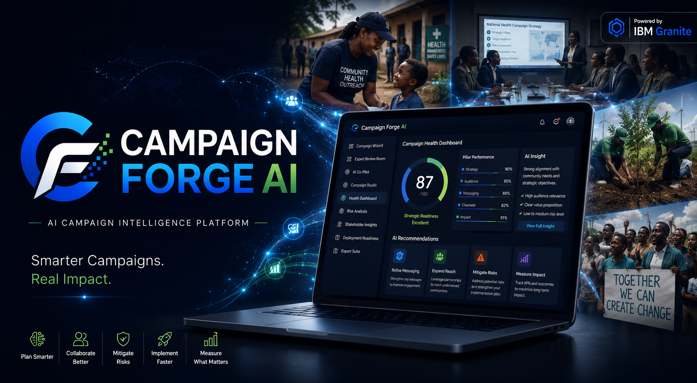
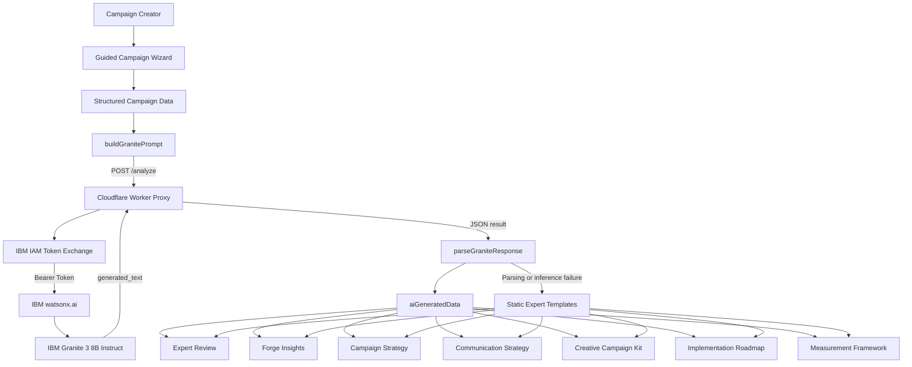

<div align="center">



# Campaign Forge AI

### **Forge Ideas. Inspire Action.**

**An AI-powered Creative Intelligence Platform that helps creators transform raw ideas into implementation-ready campaigns through structured creative collaboration and intelligent AI assistance.**

<p>


</p>

</div>

---

## ✨ At a Glance

Campaign Forge AI helps creators move beyond isolated AI prompts and disconnected creative tools.

It brings campaign thinking into one structured workflow where ideas can be explored, challenged, refined, and developed into campaigns ready for real-world implementation.

### What Campaign Forge AI Helps You Do

- 💡 **Find and frame the challenge** behind an idea.
- 🧠 **Strengthen campaign strategy** through structured creative thinking.
- 🤖 **Collaborate with AI** to explore ideas, perspectives, and creative directions.
- 🔍 **Challenge and refine concepts** before moving toward execution.
- 🎨 **Develop campaign-ready creative assets** and messaging.
- 📊 **Evaluate campaign readiness** and identify opportunities for improvement.
- 🚀 **Move from idea to implementation** with greater clarity and confidence.

---

## Table of Contents

- [Product Vision](#-product-vision)
- [Why "Forge"?](#-why-"forge"?)
- [The Challenge](#-the-challenge)
- [Our Solution](#-our-solution)
- [Why Campaign Forge AI Matters](#-why-campaign-forge-ai-matters)
- [What Makes Campaign Forge AI Different](#-what-makes-campaign-forge-ai-different?) 
- [Design Principles](#-design-principles)
- [Who Campaign Forge AI Is For](#-who-campaign-forge-ai-is-for)
- [How Campaign Forge AI Works](#-how-campaign-forge-ai-works)
- [The FORGE Framework](#%EF%B8%8F-the-forge-framework)
- [AI Approach & IBM Technology](#-ai-approach--ibm-technology)
- [Technical Architecture & Data Flow](#%EF%B8%8F-technical-architecture--data-flow)
- [Technology Stack](#-technology-stack)
- [Design Philosophy](#-design-philosophy)
- [Repository Structure](#-repository-structure)
- [Getting Started](#-getting-started)
- [Demo](#-demo)
- [Roadmap](#%EF%B8%8F-roadmap)
- [Acknowledgements](#-acknowledgements) 

# 🎯 Product Vision

Every meaningful campaign begins with an idea.

Turning that idea into something strategic, creative, measurable, and ready for real-world implementation is where the real work begins.

Campaign development often involves moving between brainstorming sessions, planning documents, AI tools, messaging frameworks, design platforms, and feedback channels. The result can be a fragmented process where promising ideas lose momentum before they ever become actionable campaigns.

Campaign Forge AI was created to bring that process together.

Our vision is to help creators move from **idea → strategy → refinement → creative development → evaluation → implementation** through one connected, intelligent workflow.

The goal is not to replace human creativity.

It is to **strengthen it**.

Campaign Forge AI combines structured campaign thinking with AI-assisted exploration and refinement, helping creators think more critically about their ideas, identify weaknesses earlier, and develop campaigns with greater clarity and confidence.

---

# ⚒️ Why "Forge"?

A forge is where something raw is shaped, strengthened, and transformed into something stronger.

Campaign Forge AI applies the same philosophy to ideas.

Every campaign begins as something unfinished—a thought, a problem, a question, or an ambition.

Through structured thinking, strategic refinement, creative exploration, and intelligent AI assistance, that raw idea is gradually forged into something more purposeful and ready for action.

That philosophy also inspired the **FORGE Framework**, the structured process at the heart of Campaign Forge AI:

**F — Find the Challenge**  
Identify the problem, audience, context, and campaign objective.

**O — Organize the Strategy**  
Structure the campaign strategy, messaging, audience, and approach.

**R — Refine the Idea**  
Challenge, evaluate, and strengthen the campaign concept.

**G — Generate Creative Assets**  
Develop creative directions, messaging, and campaign materials.

**E — Evaluate Success**  
Assess campaign quality, effectiveness, and readiness for implementation.

The framework represents the journey from a raw campaign idea to a stronger, more structured, and implementation-ready campaign.

---

# 🚨 The Challenge

The world doesn't need more AI-generated content.

It needs better campaigns.

Artificial intelligence has made it easier than ever to generate text, images, ideas, and creative outputs.

But generating content is not the same as developing a campaign.

A successful campaign requires more than a good prompt. It requires understanding the problem, identifying the right audience, developing a clear strategy, building compelling messaging, challenging assumptions, refining creative direction, and evaluating whether the campaign is actually ready to succeed.

Today, much of this process remains fragmented across disconnected tools and workflows.

Creators may use one tool to brainstorm, another to generate content, another to develop strategy, and several others to review, refine, and organize their work.

This fragmentation creates a gap between **having an idea** and **building a campaign capable of creating real-world impact**.

Campaign Forge AI was created to address that gap.

---

# 💡 Our Solution

Campaign Forge AI is an AI-powered Creative Intelligence Platform designed to help creators transform raw ideas into implementation-ready campaigns.

Instead of treating AI as a simple content generator, Campaign Forge AI positions AI as a collaborative intelligence layer within the campaign development process.

The platform guides creators through a connected workflow where they can:

- Define and understand the challenge.
- Structure campaign strategy.
- Explore and develop ideas.
- Receive AI-assisted perspectives and feedback.
- Refine campaign concepts.
- Develop creative directions and assets.
- Evaluate campaign readiness.
- Move toward implementation with greater clarity.

The result is a more structured approach to campaign development—one that combines **human creativity, strategic thinking, and AI-assisted intelligence**.

Campaign Forge AI does not aim to replace the creator.

It aims to help the creator **think better, create smarter, and move from ideas to action**.

---

# 🌍 Why Campaign Forge AI Matters

Campaigns influence how people think, learn, act, and respond.

They can raise awareness about public health challenges, mobilize communities, support education, influence policy, advance social causes, and drive meaningful action.

The quality of the campaign development process therefore matters.

A strong idea can fail because it was never properly structured.

A promising strategy can weaken because its assumptions were never challenged.

A creative concept can lose its impact because the messaging was never refined.

Campaign Forge AI is designed to help creators address these gaps before they become barriers to implementation.

By bringing structured campaign thinking and AI-assisted intelligence into one workflow, the platform aims to help creators develop campaigns that are not only creative—but also strategic, purposeful, and ready for real-world impact.

---

# 🔍 What Makes Campaign Forge AI Different?

Most AI creative tools begin with a prompt.

Campaign Forge AI begins with an idea.

Traditional AI tools often focus on generating individual outputs—text, images, headlines, or other content.

Campaign Forge AI focuses on the **campaign development journey behind those outputs**.

Instead of asking creators to repeatedly generate and regenerate content, the platform encourages a structured process of thinking, challenging, refining, creating, and evaluating.

This creates a shift:

> **From generating content → to developing campaigns.**

> **From isolated prompts → to structured creative intelligence.**

> **From ideas that remain ideas → to campaigns ready for action.**

The platform brings together campaign strategy, creative development, AI-assisted reasoning, and evaluation within a connected workflow.

---

# 🎯 Design Principles

Campaign Forge AI was built around four guiding principles.

## Human Creativity First

Human creativity remains at the center of every campaign.

AI is used to support exploration, reasoning, and refinement while keeping the creator in control of the final direction and decisions.

---

## Structured Creativity

Great campaigns rarely happen by accident.

A structured workflow helps creators move from an initial idea toward a clearer strategy and stronger creative outcome.

---

## Explainable Intelligence

AI-assisted recommendations should be understandable and useful.

Campaign Forge AI is designed to help creators see different perspectives, identify areas for improvement, and make more informed creative decisions.

---

## Built for Real-World Impact

The goal is not simply to produce content.

The goal is to help creators develop campaigns that are practical, purposeful, measurable, and ready to move beyond the screen into the real world.

---

# 👥 Who Campaign Forge AI Is For

Campaign Forge AI is designed for creators and teams who need more than content generation.

It can support:

- 🌍 **Non-profit organizations**
- 🏥 **Public health teams**
- 🎓 **Educators and education initiatives**
- 📣 **Advocacy and social impact organizations**
- 🚀 **Startups and emerging ventures**
- 💼 **Marketing and communications teams**
- 👩🏽‍🎓 **Student innovators and young creators**
- 🌱 **Social enterprises**

Whether developing a public health awareness campaign, launching an advocacy initiative, supporting an educational movement, or building a social impact campaign, Campaign Forge AI is designed to help creators move from **idea to action** with greater structure and confidence.
---

# 🧩 How Campaign Forge AI Works

Campaign Forge AI is built around a simple idea:

> **Campaigns should be forged, not just generated.**

The platform combines structured campaign thinking with AI-assisted creativity to help creators move from an initial idea toward a clearer, stronger campaign concept.

Rather than treating AI as a one-click content generator, Campaign Forge AI is designed as a guided creative environment where human judgment remains at the center of the process.

The creator brings the context, purpose, experience, and creative direction.

AI helps expand the possibilities, support exploration, and accelerate the creative process.

At the heart of the experience is the **FORGE Framework**—the framework that gives Campaign Forge AI its identity and provides the conceptual structure behind the campaign-building journey.

---

# ⚒️ The FORGE Framework

The FORGE Framework provides a structured approach to developing campaigns.

### **F — Find the Challenge**

Every strong campaign begins with a clearly understood challenge.

This stage focuses on identifying the problem, understanding the context, recognizing the audience, and defining what the campaign is trying to change.

The objective is to ensure that creators are solving the right problem before moving into creative execution.

---

### **O — Organize the Strategy**

Once the challenge is understood, the next step is to bring structure to the idea.

This involves thinking through the campaign's purpose, audience, messaging direction, and intended outcomes.

The goal is to transform an initial idea into a clearer strategic direction.

---

### **R — Refine the Idea**

Good ideas become stronger when they are questioned.

This stage focuses on reviewing the campaign concept, challenging assumptions, identifying gaps, and strengthening the overall direction.

The creator is encouraged to look at the idea from different perspectives before moving toward execution.

---

### **G — Generate Creative Assets**

Once the strategic direction is clearer, the campaign can begin taking creative form.

This stage focuses on developing the creative direction and campaign materials needed to communicate the idea effectively to its intended audience.

The aim is to connect creative output to the underlying campaign strategy.

---

### **E — Evaluate Success**

A campaign should not only look good—it should have a clear purpose and a way to understand whether it is achieving that purpose.

This stage encourages creators to reflect on the strength, relevance, and potential effectiveness of the campaign before moving toward implementation.

The objective is to help creators identify opportunities for improvement and make more informed decisions.

---

## 🔄 From Idea to Action

The FORGE Framework represents a connected journey from understanding a challenge to moving toward action.

| Stage | Focus |
|---|---|
| **F — Find the Challenge** | Understand the problem, context, audience, and campaign objective. |
| **O — Organize the Strategy** | Bring structure to the campaign idea and strategic direction. |
| **R — Refine the Idea** | Challenge assumptions, identify gaps, and strengthen the concept. |
| **G — Generate Creative Assets** | Translate the campaign direction into creative ideas and materials. |
| **E — Evaluate Success** | Reflect on campaign quality, relevance, effectiveness, and readiness. |
| **Action** | Move the refined campaign toward real-world implementation. |

Campaign Forge AI brings this thinking into a single creative experience.

The process is intentionally designed to keep the creator involved at every stage.

AI does not replace the creator's judgment.

Instead, it acts as an intelligent creative partner that can help the creator explore possibilities, think through ideas, and move faster from concept to execution.

---

## 🚀 Start Forging

The **Start Forging** experience is the entry point into the Campaign Forge AI journey.

It represents the transition from having an idea to actively developing it.

Instead of beginning with a blank canvas and an overwhelming collection of disconnected tools, the experience is designed around the campaign development process itself.

The creator begins with an idea or challenge and enters the process of forging it into something clearer and more actionable.

The objective is simple:

> **Start with an idea. Forge it into something that can move.**

---

## 📖 Learn the Forge Framework

Campaign Forge AI also introduces creators to the thinking behind the platform through the **Learn the Forge Framework** experience.

This provides context around the five stages of the framework and the role each stage plays in developing a stronger campaign.

The framework is designed to be useful beyond the platform itself.

It provides a repeatable way of thinking about campaign development that creators can apply to different types of projects, organizations, and social impact challenges.

---

## 🤝 Human Creativity + AI

Campaign Forge AI is built around collaboration between human creativity and artificial intelligence.

The creator remains responsible for the purpose, context, judgment, and final decisions behind the campaign.

AI provides an additional layer of intelligence that can support creative exploration and help accelerate parts of the development process.

This relationship can be represented simply as:

**Human Context → Human Creativity → AI-Assisted Exploration → Strategic Refinement → Creative Development → Campaign Direction**

The goal is not to create campaigns without humans.

The goal is to help humans create better campaigns with the support of AI.

---

## 🎯 The Campaign Forge Philosophy

Campaign Forge AI is built on the belief that the best use of AI in creative work is not simply to produce more content.

It is to help people **think, explore, question, and create more effectively**.

The platform therefore focuses on the space between:

> **"I have an idea."**

and

> **"I have something I can act on."**

Campaign Forge AI exists to help creators navigate that space.

**Forge the idea. Strengthen the strategy. Create with intention. Move toward action.**

---
# 🤖 AI Approach & IBM Technology

Campaign Forge AI uses AI as an **assistive reasoning layer within a structured campaign-development workflow**.

The goal is not to replace the creator's judgment or turn campaign development into a one-click generation process. Instead, AI is used to help creators explore, assess, refine, and develop campaign ideas while keeping the human creator at the center of the process.

The AI integration is built around **IBM Granite models accessed through IBM watsonx.ai**, with a Cloudflare Worker providing the server-side proxy between the browser application and IBM's inference services.

---

## 🧠 Structured Campaign Context

Campaign Forge AI begins by collecting structured campaign information through its guided campaign wizard.

The application gathers campaign inputs covering areas such as:

- Campaign purpose and goals
- The challenge or problem being addressed
- Target audience
- Sector and context
- Communication channels
- Tone and creative direction
- Activities and implementation considerations
- Partners and stakeholders
- Risks
- KPIs and measurement considerations

These inputs are maintained as structured application data and are used to construct the context provided to the AI model.

This approach means that the AI does not receive an isolated question with no context. Instead, it receives a structured representation of the campaign being developed.

---

## 🧩 Structured Prompt Construction

The campaign information collected through the wizard is assembled into a structured prompt through the application's prompt-construction layer.

The `buildGranitePrompt()` function combines campaign data and selected options into a labelled prompt designed to provide Granite with the context required for campaign analysis and development.

The system prompt frames Granite as a **five-expert consulting team**, guiding the model to examine the campaign from multiple professional perspectives and return a structured response.

This is a **prompt-based expert framework**, rather than a multi-agent architecture. The application does not claim to run five independent AI agents. Instead, a single Granite inference process is structured to simulate a multi-perspective consulting review.

The expected AI response is a structured JSON object that can be parsed and used by different parts of the application.

---

## ⚙️ IBM Granite + watsonx.ai

Campaign Forge AI uses IBM Granite as its foundation model layer through IBM watsonx.ai.

The default configured model is:

`ibm/granite-3-8b-instruct`

The application communicates with the model through the watsonx.ai text generation API.

The AI integration follows this general sequence:

1. The creator completes the guided campaign workflow.
2. Campaign inputs are assembled into a structured prompt.
3. The browser sends the prompt to the Campaign Forge AI Cloudflare Worker.
4. The Worker exchanges the IBM Cloud API key for an IBM IAM bearer token.
5. The Worker forwards the structured prompt to the watsonx.ai text generation endpoint.
6. Granite generates the campaign analysis and structured response.
7. The Worker returns the generated result to the browser.
8. The application parses the structured response.
9. The resulting AI data is distributed across relevant campaign-development surfaces.

---

## 🔐 Secure API Proxy Architecture

The IBM Cloud API key is **not stored in the browser application**.

Instead, the integration uses a Cloudflare Worker as a server-side proxy.

The Worker stores the IBM Cloud API key as a Cloudflare Worker Secret named:

`IBM_API_KEY`

The browser only stores the Worker URL and selected model configuration for the current session. The IBM API key remains on the server-side Worker environment.

The Worker is responsible for:

- Receiving campaign analysis requests.
- Exchanging the IBM API key for an IAM bearer token.
- Calling the watsonx.ai text generation API.
- Returning the generated result to the browser.
- Handling CORS preflight requests.
- Providing `/analyze` and `/test` endpoints.
- Temporarily caching IAM tokens within the Worker isolate to reduce repeated token exchanges.

This architecture keeps the IBM credential outside the client-side application.

> **Security note:** The current prototype uses permissive CORS and does not authenticate individual users. For a production deployment, the Worker should restrict allowed origins and introduce appropriate access controls.

---

## 🧱 AI Output Processing

The generated response is not displayed directly as raw model output.

Campaign Forge AI uses a response-processing layer to extract structured data from the Granite response.

The `parseGraniteResponse()` function is responsible for:

- Removing Markdown code fences when present.
- Locating the outer JSON boundaries.
- Parsing the structured response.
- Handling certain common formatting issues such as trailing commas.
- Returning a failure state when the response cannot be parsed successfully.

When successfully parsed, the resulting data is stored in the application's `aiGeneratedData` runtime state.

This allows the AI output to be used across different campaign-development surfaces rather than being presented as a single block of generated text.

---

## 🎯 AI-Powered Campaign Development Surfaces

AI-generated data can be used to populate multiple areas of the Campaign Forge AI experience, including:

- **Expert Review Room** — AI-assisted expert assessments, scores, and recommendations.
- **Forge Insights** — strategic insights derived from the campaign context.
- **Expert Collaboration** — a structured consulting-style discussion and team recommendation.
- **Campaign Strategy Brief** — campaign overview, problem framing, goals, audience, and strategic direction.
- **Communication Strategy** — core messaging, audience insights, and channel considerations.
- **Creative Campaign Kit** — slogans, creative concepts, visual direction, social content, and storytelling ideas.
- **Implementation Roadmap** — activities, timelines, stakeholder considerations, and engagement approaches.
- **Measurement Framework** — indicators, KPIs, data sources, and evaluation considerations.

The purpose of this architecture is to connect AI assistance to the broader campaign-development journey rather than treating AI generation as an isolated feature.

---

## 🛡️ Graceful AI Fallback

Campaign Forge AI is designed so that live AI inference is not the only path through the experience.

If AI credentials are unavailable, the IAM token exchange fails, the watsonx.ai request returns an error, or the generated response cannot be parsed successfully, the application can fall back to pre-built expert templates developed within the application.

This creates a more resilient experience in which campaign development can continue even when live AI inference is unavailable.

The AI therefore acts as an enhancement layer rather than a single point of failure for the entire application experience.

---

# 🏗️ Technical Architecture & Data Flow

The technical architecture connects the campaign-building interface, structured prompt layer, Cloudflare Worker proxy, IBM IAM, watsonx.ai, and Granite.



## 🔄 Core Data Flow

The main AI request cycle follows this sequence:

    Creator
        ↓
    Guided Campaign Wizard
        ↓
    Structured Campaign Data
        ↓
    buildGranitePrompt()
        ↓
    POST /analyze
        ↓
    Cloudflare Worker Proxy
        ↓
    IBM IAM Token Exchange
        ↓
    watsonx.ai
        ↓
    IBM Granite
        ↓
    Generated Structured Response
        ↓
    parseGraniteResponse()
        ↓
    aiGeneratedData
        ↓
    Campaign Development Modules

If the AI request or response processing fails:

    AI Inference Failure
            ↓
    Response Parsing Failure
            ↓
    Static Expert Templates
            ↓
    Campaign Development Continues

This separation allows the product to combine **structured campaign methodology, human decision-making, AI-assisted reasoning, and resilient application behavior** within a single workflow.

---

# 🧰 Technology Stack

The current implementation brings together several technologies and services:

| Layer | Technology / Component |
|---|---|
| Frontend | HTML, CSS, JavaScript |
| AI Foundation Model | IBM Granite |
| AI Platform | IBM watsonx.ai |
| Authentication | IBM IAM |
| AI Proxy / Serverless Layer | Cloudflare Workers |
| Worker Configuration | Cloudflare Wrangler |
| Runtime AI Configuration | Browser `sessionStorage` |
| AI Response Format | Structured JSON |
| Fallback Layer | Static expert templates |

The project was developed and iterated through sprint-based development, with IBM Bob used as the primary development environment during the build process.

---

# 🔭 Design Philosophy

The technical architecture reflects the broader philosophy behind Campaign Forge AI:

> **AI should strengthen structured thinking, not replace it.**

The creator remains responsible for the campaign's purpose, context, judgment, and final decisions.

The AI layer provides additional reasoning capacity, structured analysis, creative exploration, and campaign-development support.

The FORGE Framework provides the methodology.

The guided wizard provides the structure.

IBM Granite and watsonx.ai provide AI-assisted reasoning.

The creator brings the judgment.

Together, these components form the Campaign Forge AI experience.

# 📁 Repository Structure

The repository is organized to separate the main Campaign Forge AI experience, development playground files, visual assets, configuration, and the IBM Granite integration layer.

```text
Campaign-Forge-AI/
├── .vscode/
│   └── launch.json
│
├── assets/
│   ├── screenshots/
│   └── banner.png
│
├── db/
│   └── bob.db
│
├── playground/
│   ├── cloudflare-worker/
│   │   ├── DEPLOY.md
│   │   ├── worker.js
│   │   └── wrangler.toml
│   │
│   ├── Menu.html
│   ├── campaign-forge-ai-home-studio-guided-wizard.html
│   ├── campaign-forge-ai.html
│   └── sprint-6-ibm-granite-ai-integration.html
│
├── settings/
│   └── settings.json
│
└── README.md

└── README.md
```

## Key Directories and Files

- **`.vscode/`** — Development and debugging configuration for the project.
- **`assets/`** — Visual assets used by the project, including the main banner and product screenshots.
- **`db/`** — Project database and application data resources.
- **`playground/`** — Main prototype and development workspace containing the Campaign Forge AI application files and supporting experiments.
- **`playground/cloudflare-worker/`** — Server-side proxy layer used to connect the Campaign Forge AI application with IBM watsonx.ai and IBM Granite while keeping the IBM API key out of the browser.
- **`playground/cloudflare-worker/worker.js`** — Cloudflare Worker implementation responsible for handling requests between the frontend and IBM's AI services.
- **`playground/cloudflare-worker/wrangler.toml`** — Cloudflare Worker deployment and environment configuration.
- **`playground/cloudflare-worker/DEPLOY.md`** — Deployment instructions for configuring and deploying the Cloudflare Worker.
- **`settings/`** — Project-level configuration files.

# 🚀 Getting Started

Campaign Forge AI is currently available as a browser-based HTML prototype that can be run locally without a traditional build process.

## 1. Clone the Repository

```bash
git clone https://github.com/real-gozie/Campaign-Forge-AI.git
cd Campaign-Forge-AI
```

## 2. Open the Prototype

Navigate to the `playground/` directory and open:

```text
campaign-forge-ai.html
```

You can open the file directly in a modern web browser such as Google Chrome, Microsoft Edge, or Mozilla Firefox.

## 3. Explore the Campaign Workflow

Once the prototype is open, users can explore the Campaign Forge AI experience, including:

- Campaign development through the guided workflow
- The FORGE Framework
- AI-assisted campaign analysis
- Five-perspective expert review
- Strategic insights and recommendations
- Communication strategy development
- Creative campaign development
- Implementation planning
- Measurement and evaluation
- Campaign export options

## 4. IBM Granite AI Integration

The prototype also includes an IBM Granite integration layer using a Cloudflare Worker proxy.

To use live IBM Granite inference, the Cloudflare Worker must be configured and deployed according to the instructions provided in:

```text
playground/cloudflare-worker/DEPLOY.md
```

The IBM API credentials are handled through the Cloudflare Worker rather than being exposed directly in the browser.

If the IBM Granite integration is not configured or unavailable, Campaign Forge AI is designed to continue using its built-in fallback expert templates.

> **Note:** The current prototype is primarily intended for demonstration and evaluation. A future production deployment can provide a hosted web experience so users and judges can access Campaign Forge AI without downloading or opening the HTML files manually.

# 🚀 Demo

Campaign Forge AI is currently available as a browser-based prototype that can be run locally.

To explore the prototype:

1. Clone or download the repository.
2. Open the `playground/` directory.
3. Open `campaign-forge-ai.html` in a modern web browser.

The prototype demonstrates the complete Campaign Forge AI experience, including the structured campaign-development workflow, FORGE Framework, AI-assisted expert review, strategic insights, creative development, implementation planning, measurement, and campaign export capabilities.

> **Demo access:** A hosted version of Campaign Forge AI is planned for future deployment. For the current prototype, please run the application locally using the instructions in the [Getting Started](#getting-started) section.
- **`README.md`** — Project documentation, architecture overview, setup information, and development notes.

# 🗺️ Roadmap

Campaign Forge AI is currently a working prototype focused on demonstrating an integrated campaign-development workflow powered by structured thinking and AI-assisted analysis.

Future development will focus on moving the prototype toward a more accessible, scalable, and production-ready platform.

## Near-Term Priorities

- **🌐 Hosted Web Experience** — Deploy Campaign Forge AI as an accessible web application so users can explore the platform without downloading or opening HTML files locally.
- **📸 Product Documentation** — Expand visual documentation with screenshots and guided walkthroughs of the core campaign-development experience.
- **📄 Campaign Export Improvements** — Strengthen campaign export capabilities across Markdown, DOCX, and PDF formats for easier sharing, review, and implementation.
- **🤖 AI Reliability & Evaluation** — Continue improving the quality, consistency, explainability, and reliability of IBM Granite-assisted campaign analysis.
- **🔐 Production Security** — Strengthen authentication, access controls, CORS restrictions, and other security measures required for a production deployment.
- **📊 Campaign Performance Tracking** — Explore ways to connect campaign planning with real-world implementation and performance monitoring.
- **💾 Campaign Persistence** — Enable users to securely save, revisit, version, and continue developing campaigns over time.
- **👥 Collaboration Features** — Explore collaborative workflows that allow campaign teams, partners, and stakeholders to review and refine campaigns together.

## Long-Term Vision

The long-term goal is to evolve Campaign Forge AI from a browser-based prototype into a comprehensive campaign development environment that helps individuals and teams move from an initial idea to a structured, creative, measurable, and implementation-ready campaign.

The platform will continue to prioritize human judgment and creativity, using AI as an assistive layer that helps users think more critically, identify gaps, explore possibilities, and strengthen their campaign decisions.

# 🙏 Acknowledgements

Campaign Forge AI was developed with inspiration and support from the broader open-source, AI, and social impact communities.

Special acknowledgement goes to:

- **IBM** — for providing IBM Granite and IBM watsonx.ai technologies that support the platform's AI-assisted campaign analysis and development workflow.
- **IBM Bob** — for providing the development environment used to prototype and build Campaign Forge AI.
- **Cloudflare** — for providing the Worker infrastructure used as the server-side proxy for the IBM Granite integration.
- **Open-source contributors and communities** — whose tools, libraries, documentation, and shared knowledge continue to make experimentation and innovation more accessible.

Campaign Forge AI is built around the belief that technology should help people turn ideas into meaningful action—and that AI is most valuable when it strengthens human creativity, critical thinking, and decision-making.
